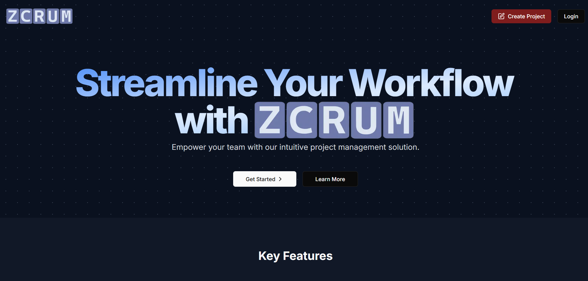

# Full Stack Zcrum by Harsh Durvesh Rudra Clone with Next JS, React, Tailwind CSS, Prisma, Neon, Clerk, Shadcn UI  🔥🔥
## Work in Progress



## <a name="tech-stack">⚙️ Tech Stack</a>

- Next.js
- TypeScript
- PostgreSql
- Lexical Editor
- ShadCN
- Tailwind CSS

## <a name="features">🔋 Features</a>

👉 **Authentication**: User authentication using GitHub through NextAuth, ensuring secure sign-in/out and session management.

👉 **Collaborative Text Editor**: Multiple users can edit the same document simultaneously with real-time updates.

👉 **Project Management**
   - **Create Project**: Users can create new project, which are automatically saved and listed.
   - **Delete Project**: Users can delete project they own.
   - **Share Project**: Users can share project via email or link with view/edit permissions.
   - **List Project**: Display all project owned or shared with the user, with search and sorting functionalities.

👉 **Comments**: Users can add inline and general comments, with threading for discussions.

👉 **Active Collaborators**: Show active collaborators with real-time presence indicators.

👉 **Notifications**: Notify users of document shares, new comments, and collaborator activities.

👉 **Responsive**: The application is responsive across all devices.

and many more, including code architecture and reusability 

## <a name="quick-start">🤸 Quick Start</a>

Follow these steps to set up the project locally on your machine.

**Prerequisites**

Make sure you have the following installed on your machine:

- [Git](https://git-scm.com/)
- [Node.js](https://nodejs.org/en)
- [npm](https://www.npmjs.com/) (Node Package Manager)

**Cloning the Repository**

```bash
https://github.com/panduthegang/Zcrum.git
cd collaborative-editor
```

**Installation**

Install the project dependencies using npm:

```bash
npm install
```

**Set Up Environment Variables**

Create a new file named `.env` in the root of your project and add the following content:

```env
DATABASE_URL=

NEXT_PUBLIC_CLERK_PUBLISHABLE_KEY=
CLERK_SECRET_KEY=

NEXT_PUBLIC_CLERK_SIGN_IN_URL=/sign-in
NEXT_PUBLIC_CLERK_SIGN_UP_URL=/sign-up
NEXT_PUBLIC_CLERK_AFTER_SIGN_IN_URL=/onboarding
NEXT_PUBLIC_CLERK_AFTER_SIGN_UP_URL=/onboarding
```

Replace the placeholder values with your actual Clerk & LiveBlocks credentials. You can obtain these credentials by signing up on the [Clerk](https://clerk.com/) and [Neon](neon.tech/) website.

**Running the Project**

```bash
npm run dev
```

Open [http://localhost:3000](http://localhost:3000) in your browser to view the project.


